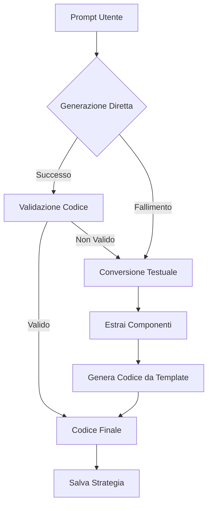

# Approccio Ibrido per Generazione Strategie FreqTrade

## Panoramica

Il progetto implementa un **approccio ibrido** per la generazione di strategie FreqTrade con LLM, che combina i vantaggi di entrambi i metodi:

1. **Generazione Diretta di Codice**
2. **Conversione Testuale → Codice**

## Confronto degli Approcci

### 1. Generazione Diretta di Codice

**Vantaggi:**
- ⚡ **Veloce**: Un solo passaggio di generazione
- 🎯 **Preciso**: Controllo diretto sul codice generato
- 🔧 **Flessibile**: Può adattare il codice in base al contesto
- 📊 **Ottimizzato**: Può includere logiche complesse

**Svantaggi:**
- ❌ **Errori di Sintassi**: Maggiore rischio di codice non valido
- 🔄 **Manutenzione**: Difficile aggiornare quando FreqTrade cambia API
- 🎓 **Complessità**: Richiede LLM molto addestrati su FreqTrade

### 2. Conversione Testuale → Codice

**Vantaggi:**
- 🛡️ **Robusto**: Meno errori di sintassi
- 🔧 **Modulare**: Separazione delle responsabilità
- 📚 **Semplice**: LLM generici possono descrivere strategie
- 🔄 **Manutenibile**: Più facile aggiornare il convertitore

**Svantaggi:**
- ⏱️ **Lento**: Due passaggi (descrizione + conversione)
- 📉 **Rigido**: Limitazioni del convertitore
- 🔍 **Perdita di Dettagli**: Alcuni aspetti potrebbero non essere tradotti

### 3. Approccio Ibrido (Raccomandato)

**Vantaggi:**
- ✅ **Affidabile**: Fallback automatico se la generazione diretta fallisce
- ⚡ **Veloce**: Prova prima la generazione diretta
- 🛡️ **Robusto**: Conversione testuale come backup
- 🎯 **Ottimale**: Usa il metodo migliore per ogni situazione

**Svantaggi:**
- 🔧 **Complessità**: Implementazione più complessa
- ⏱️ **Overhead**: Controlli di validazione aggiuntivi

## Implementazione

### StrategyConverter

Il modulo `StrategyConverter` gestisce la conversione da testo a codice:

```python
from agents.strategy_converter import StrategyConverter

converter = StrategyConverter()

# Conversione da descrizione testuale
text_description = """
Strategia che usa RSI e EMA:
- Entra quando RSI < 30 e EMA corta > EMA lunga
- Esci quando RSI > 70 o EMA crossover negativo
"""

strategy_code = converter.convert_text_to_strategy(text_description)

# Validazione e correzione di codice esistente
fixed_code = converter.validate_and_fix_code(invalid_code)
```

### GeneratorAgent (Aggiornato)

Il `GeneratorAgent` ora supporta l'approccio ibrido:

```python
from agents.generator import GeneratorAgent

generator = GeneratorAgent(default_model="phi3")

# Approccio ibrido (default)
strategy = generator.generate_strategy(prompt, use_hybrid=True)

# Solo generazione diretta
strategy = generator.generate_strategy(prompt, use_hybrid=False)

# Strategia futures specifica
strategy = generator.generate_futures_strategy("volatility", use_hybrid=True)
```

## Flusso dell'Approccio Ibrido



### Dettaglio del Processo

1. **Tentativo Generazione Diretta**
   - LLM genera codice Python direttamente
   - Timeout ridotto (50% del tempo totale)

2. **Validazione Codice**
   - Parsing sintattico con `ast.parse()`
   - Controllo elementi FreqTrade richiesti
   - Correzione errori comuni

3. **Fallback Conversione Testuale**
   - LLM genera descrizione testuale
   - `StrategyConverter` estrae componenti
   - Generazione codice da template

4. **Strategia Finale**
   - Codice valido e funzionante
   - Salvataggio automatico

## Esempi di Utilizzo

### Esempio 1: Strategia Semplice

```python
prompt = "Crea una strategia che usa RSI e EMA per trading futures"

# Approccio ibrido (raccomandato)
strategy = generator.generate_strategy(prompt, use_hybrid=True)
```

### Esempio 2: Strategia Complessa

```python
prompt = """
Strategia di breakout per futures:
- Identifica rotture con Bollinger Bands
- Conferma con volume
- Stop loss dinamico con ATR
- Supporta long/short
"""

strategy = generator.generate_strategy(prompt, use_hybrid=True)
```

### Esempio 3: Strategia Futures Specifica

```python
# Genera strategia di volatilità
strategy = generator.generate_futures_strategy("volatility", use_hybrid=True)

# Genera strategia di scalping
strategy = generator.generate_futures_strategy("scalping", use_hybrid=True)
```

## Configurazione

### Modelli LLM

L'approccio ibrido funziona meglio con modelli veloci:

```python
# Modelli raccomandati (in ordine di velocità)
fast_models = ["phi3", "llama2", "mistral", "codellama"]
```

### Timeout

```python
# Timeout consigliati
timeout_total = 1800  # 30 minuti totali
timeout_direct = timeout_total // 2  # 15 minuti per generazione diretta
timeout_text = timeout_total // 2    # 15 minuti per conversione testuale
```

## Best Practices

### 1. Prompt Engineering

**Per Generazione Diretta:**
```python
prompt = """
Crea una strategia Freqtrade completa per trading futures crypto volatili.
Rispondi SOLO con codice Python valido che include:
- Classe che eredita da IStrategy
- Metodi populate_indicators, populate_entry_trend, populate_exit_trend
- Indicatori tecnici (RSI, EMA, MACD, Bollinger Bands, ATR)
- Condizioni di entrata/uscita per long/short
- Gestione volatilità e stop loss dinamici
- Parametri ottimizzabili con IntParameter/DecimalParameter

Rispondi SOLO con codice Python completo e valido.
"""
```

**Per Conversione Testuale:**
```python
prompt = """
Descrivi una strategia di trading per futures crypto volatili.
Includi:
- Indicatori tecnici da utilizzare (RSI, EMA, MACD, Bollinger Bands, ATR)
- Condizioni di entrata (quando comprare/vendere)
- Condizioni di uscita (quando chiudere posizioni)
- Gestione del rischio (stop loss, take profit)
- Timeframe consigliato
- Parametri di ottimizzazione

Descrivi in linguaggio naturale, non codice.
Focus su strategie per mercati volatili con operazioni long/short.
"""
```

### 2. Validazione

Sempre validare il codice generato:

```python
# Validazione automatica nel generatore
if converter.validate_and_fix_code(strategy_code) != strategy_code:
    print("⚠️ Codice corretto automaticamente")

# Validazione manuale
try:
    ast.parse(strategy_code)
    print("✅ Sintassi valida")
except SyntaxError as e:
    print(f"❌ Errore di sintassi: {e}")
```

### 3. Testing

Testare le strategie generate:

```python
# Test con FreqTrade
result = subprocess.run([
    'freqtrade', 'show-config',
    '--config', 'user_data/config.json',
    '--strategy', 'GeneratedStrategy'
], capture_output=True, text=True)

if result.returncode == 0:
    print("✅ Strategia valida per FreqTrade")
else:
    print(f"❌ Errore: {result.stderr}")
```

## Conclusioni

L'**approccio ibrido** rappresenta la soluzione ottimale per la generazione di strategie FreqTrade con LLM:

- ✅ **Affidabilità**: Fallback automatico garantisce sempre un risultato
- ⚡ **Velocità**: Generazione diretta per la maggior parte dei casi
- 🛡️ **Robustezza**: Conversione testuale per casi complessi
- 🎯 **Flessibilità**: Adattamento automatico al tipo di richiesta

**Raccomandazione**: Usa sempre `use_hybrid=True` per la massima affidabilità e qualità delle strategie generate. 